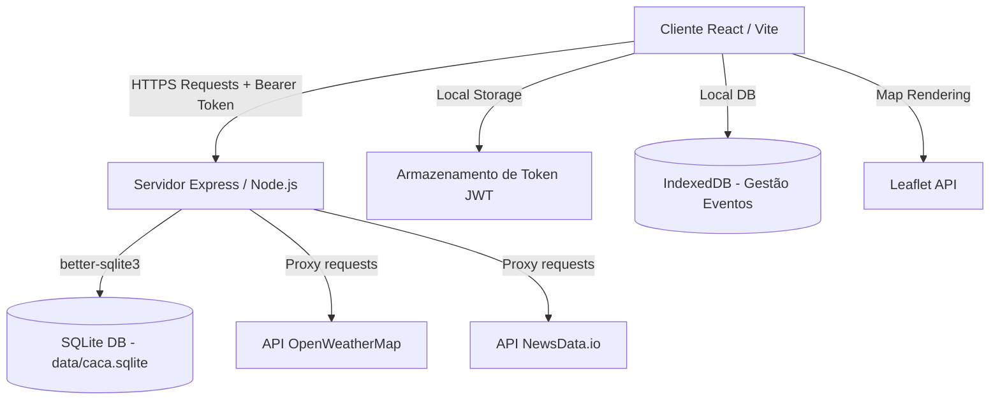

# Refatorização e Desenvolvimento da Aplicação Web do CACA (Centro Académico Clínico dos Açores)

Este repositório contém o código-fonte da aplicação web do **Centro Académico Clínico dos Açores (CACA)**, desenvolvida como projeto prático na unidade curricular de **Tecnologias Web** (Projeto PE).

O projeto consiste na refatorização e unificação das funcionalidades desenvolvidas nas fases anteriores (PEI1, PEI2 e PEI3) numa aplicação moderna baseada numa framework front-end (React) e na implementação de uma API back-end robusta para a gestão de utilizadores e persistência de dados.

---

## a) Identificação do Grupo (PE)

- **Adriano Furtado Arruda** - 2024111815
- **David Cardoso** - [Número de Aluno]
- **Nelson Ponte** - [Número de Aluno]
- **Puțan Iulia** - [Número de Aluno]

---

## b) Descrição das Tecnologias e Justificação das Escolhas

A arquitetura do projeto foi modernizada e dividida numa solução Client-Server:

### 1. Front-end: React 19 (com Vite 8)
- **Justificação:** A transição do JavaScript nativo (vanilla JS) para o **React** permitiu estruturar a aplicação de forma altamente modular através de componentes reutilizáveis e autónomos (ex: `Header`, `LandingPage`, `AuthForms`, `EventAdmin`). O React facilita a sincronização eficiente do estado da aplicação (ex: estado de autenticação do utilizador, listagem de eventos) com a interface, melhorando significativamente a manutenção e escalabilidade do código.
- **Vite:** Escolhido como ferramenta de build devido ao seu servidor de desenvolvimento ultrarrápido com Hot Module Replacement (HMR) instantâneo e geração de pacotes otimizados para produção.

### 2. Back-end: Node.js com Express
- **Justificação:** O **Express** é um ecossistema minimalista, rápido e altamente flexível para a criação de rotas e APIs RESTful em Node.js. Permite a partilha do ecossistema JavaScript em toda a stack, simplificando o desenvolvimento e reduzindo a complexidade de integração entre o cliente e o servidor.

### 3. Base de Dados: SQLite (via `better-sqlite3`)
- **Justificação:** Por se tratar de um projeto de cariz académico focado na portabilidade, optou-se pelo **SQLite** através do driver síncrono de alto desempenho `better-sqlite3`. Esta solução cria uma base de dados relacional armazenada num único ficheiro local (`data/caca.sqlite`), eliminando a necessidade de instalar e configurar um servidor de base de dados externo (zero-configuration), mantendo a integridade referencial dos utilizadores.

### 4. Autenticação e Segurança (JWT e Crypt)
- **Justificação:** Para sessões de utilizador sem estado (stateless) e seguras, a API utiliza tokens **JWT (JSON Web Tokens)** criados manualmente a partir do módulo nativo do Node.js `node:crypto` (algoritmo HMAC-SHA256). As passwords dos utilizadores são encriptadas antes do armazenamento utilizando o algoritmo **scrypt** com um *salt* único e verificação através de comparação segura contra ataques de temporização (`timingSafeEqual`).

---

## c) Estrutura e Arquitetura da Aplicação

A aplicação segue o padrão clássico cliente-servidor, comunicando através de pedidos assíncronos (HTTP/JSON).



### Arquitetura de Comunicação e Fluxo de Dados:
1. **Comunicação Assíncrona:** O cliente faz pedidos utilizando a API `fetch` encapsulada no módulo `src/services/apiClient.js`. Para rotas protegidas, o token JWT (armazenado no `localStorage` após o login) é enviado no cabeçalho `Authorization: Bearer <token>`.
2. **Proxies no Back-end:** Para evitar problemas de CORS no browser e, principalmente, **proteger chaves de API confidenciais**, as consultas meteorológicas e de notícias são encaminhadas através do servidor Express (`/api/weather/forecast` e `/api/news`), que age como proxy seguro.

### Estrutura de Pastas do Projeto:
```
PEI3/
├── data/                       # Armazenamento do ficheiro de base de dados SQLite
├── docs/                       # Planos de trabalho e documentação interna
├── js/                         # Legado da Fase 3 (módulos e código vanilla)
├── scripts/
│   └── dev.mjs                 # Script para execução concorrente de Front e Back
├── server/                     # Código do Back-end (Express API)
│   ├── auth/                   # Módulos de hashing de password e tokens JWT
│   ├── users/                  # Repositório de dados e validações da API
│   └── app.js                  # Configuração de endpoints e middlewares da API
├── src/                        # Código do Front-end (React)
│   ├── components/             # Componentes reutilizáveis da interface
│   ├── services/               # Clientes de API e gestão de persistência local
│   ├── styles/                 # Ficheiros CSS da aplicação
│   ├── App.jsx                 # Componente principal do React
│   └── main.jsx                # Ponto de entrada do cliente React
├── tests/                      # Testes automatizados (API e base de dados)
├── index.html                  # Ponto de entrada do Vite
├── server.js                   # Ponto de entrada do servidor Express
└── vite.config.js              # Configuração da ferramenta Vite
```

---

## d) Funcionalidades Implementadas

O projeto unifica a experiência acumulada nas fases anteriores com os novos requisitos de utilizadores:

### 1. Funcionalidades Migradas e Refatorizadas
- **Landing Page CACA:** Reconstruída integralmente em componentes React estruturados, com o carrossel do Hero dinâmico e animações de scroll ativadas por `IntersectionObserver`.
- **Estatísticas Dinâmicas:** Exibição do gráfico interativo de evolução de apoios à investigação, animado através de variáveis CSS.
- **Gestão de Eventos (CRUD):** Lógica da página de administração de eventos (`admin-eventos`) portada para o React, permitindo adicionar, atualizar e remover eventos armazenados localmente no browser usando a **IndexedDB** (`src/services/eventStore.js`).
- **Mapas Interativos:** O componente `EventAdmin` utiliza o **Leaflet.js** para inicializar e exibir mapas das localizações dos eventos definidos pela equipa.

### 2. Novas Funcionalidades da API de Gestão de Utilizadores
- **Registo de Utilizadores (`POST /api/auth/register`):** Permite criar contas fornecendo Nome, Email e Password. Inclui validação sintática e impede a duplicação de emails.
- **Autenticação (`POST /api/auth/login`):** Valida credenciais e gera o Token JWT caso coincidam.
- **Perfil do Utilizador (`GET /api/users/me` e `PUT /api/users/me`):** Permite ao utilizador consultar e alterar os seus dados pessoais (Nome e Email). Requer token válido passado como Bearer Token.
- **Permissões Administrativas (`GET /api/admin/users`):** Endpoint de administração restrito a utilizadores que possuam o cargo `admin`, demonstrando controlo de acessos por papéis (RBAC).

---

## e) Como Correr a Aplicação

### Pré-requisitos
- Ter o [Node.js](https://nodejs.org/) instalado na máquina (versão 18 ou superior recomendada).

### 1. Instalar as dependências
No diretório raiz do projeto, execute o comando:
```bash
npm install
```

### 2. Configurar Variáveis de Ambiente
Copie o ficheiro `.env.example` para `.env` e configure as chaves necessárias:
```bash
cp .env.example .env
```
Abra o ficheiro `.env` e edite os valores das chaves:
- `JWT_SECRET`: Uma chave secreta segura para os tokens JWT.
- `SQLITE_DB_PATH`: Caminho para a base de dados SQLite (ex: `data/caca.sqlite`).
- `WEATHER_API_KEY`: Chave da API OpenWeatherMap.
- `NEWS_API_KEY`: Chave da API NewsData.io.

### 3. Executar o Servidor em Desenvolvimento
Para correr o cliente Vite e o servidor Express em simultâneo (usando o script de execução concorrente), execute:
```bash
npm run dev
```
A aplicação estará acessível em `http://127.0.0.1:3000/`.

### 4. Executar os Testes Automatizados
O projeto conta com testes unitários e de integração baseados no executor de testes nativo do Node.js (`node --test`). Para os executar:
```bash
npm test
```

---

## f) Decisões de Design e Implementação (Desafios e Soluções)

- **Desafio 1: Sessões Stateless Descentralizadas**
  * *Contexto:* Fazer com que o servidor controle acessos sem persistência em cookies tradicionais.
  * *Solução:* Foi construído um sistema nativo de autenticação com JWT que codifica a identidade do utilizador e as suas permissões no token, permitindo validações imediatas sem consultas adicionais e mantendo a API perfeitamente RESTful.
- **Desafio 2: Execução Concorrente**
  * *Contexto:* A equipa precisava de uma forma simples de iniciar tanto o front-end quanto o back-end sem necessitar de abrir múltiplos terminais.
  * *Solução:* Foi desenvolvido o script auxiliar `scripts/dev.mjs` que utiliza processos filhos no Node.js para lançar e sincronizar a execução do Vite e do Express.
- **Desafio 3: Integração do Leaflet em React**
  * *Contexto:* O Leaflet requer acesso direto a elementos DOM montados no ecrã para calcular dimensões.
  * *Solução:* Utilizou-se o ciclo de vida do React (`useEffect`) em conjunto com pequenos atrasos assíncronos (`setTimeout`) para assegurar que a div do mapa estava totalmente renderizada no DOM antes da chamada de inicialização da biblioteca Leaflet.

---

## g) Acessibilidade, Responsividade e Segurança

### 1. Segurança
- **Passwords Seguras:** Utilização do algoritmo criptográfico `scrypt` com um salt aleatório para cada password, garantindo proteção contra ataques de dicionário e tabelas rainbow.
- **Comparação Temporizada:** Uso de `timingSafeEqual` para comparação de chaves criptográficas, prevenindo ataques de canal lateral (timing attacks).
- **Controlo de Acesso:** Proteção do endpoint `/api/admin/users` com middleware dedicado de validação de cargo (`requireRole('admin')`).
- **Validação de Entrada:** Uso de padrões robustos de verificação no back-end para filtrar entradas maliciosas e prevenir ataques de injeção.

### 2. Acessibilidade (a11y)
- **Navegação por Teclado:** Foco explícito e ordem de tabulação lógica para todos os botões e campos de formulário.
- **Leitores de Ecrã:** Atributos como `aria-live="polite"` no componente `App` para garantir que mensagens de erro ou sucesso na API são lidas instantaneamente aos utilizadores. Atributos `aria-label` em botões de imagem ou ícones sem texto legível.
- **HTML Semântico:** Utilização de tags HTML5 estruturais (`<main>`, `<section>`, `<article>`, `<header>`, `<footer>`) facilitando o rastreamento da página.

### 3. Responsividade
- A folha de estilos do projeto (`src/styles/app.css`) foi desenhada com Flexbox e Grid CSS, garantindo layouts fluidos.
- Foram implementadas media queries para se adaptar a ecrãs móveis (mobile), tablets e desktops, mantendo a integridade de leitura das estatísticas e grelhas de notícias.

---

## h) APIs Externas Utilizadas

1. **OpenWeatherMap API:** Consumida para obter a previsão do tempo de 5 dias em formato JSON. Utilizada para informar a previsão climática para os eventos e localizações criadas na plataforma.
2. **NewsData.io API:** Utilizada para obter notícias de saúde regionais mais recentes em tempo real.
3. **Leaflet.js Map API:** Utilizada no cliente para renderização de mapas geográficos baseados em dados do OpenStreetMap, para a visualização dos eventos criados no painel de administração.
